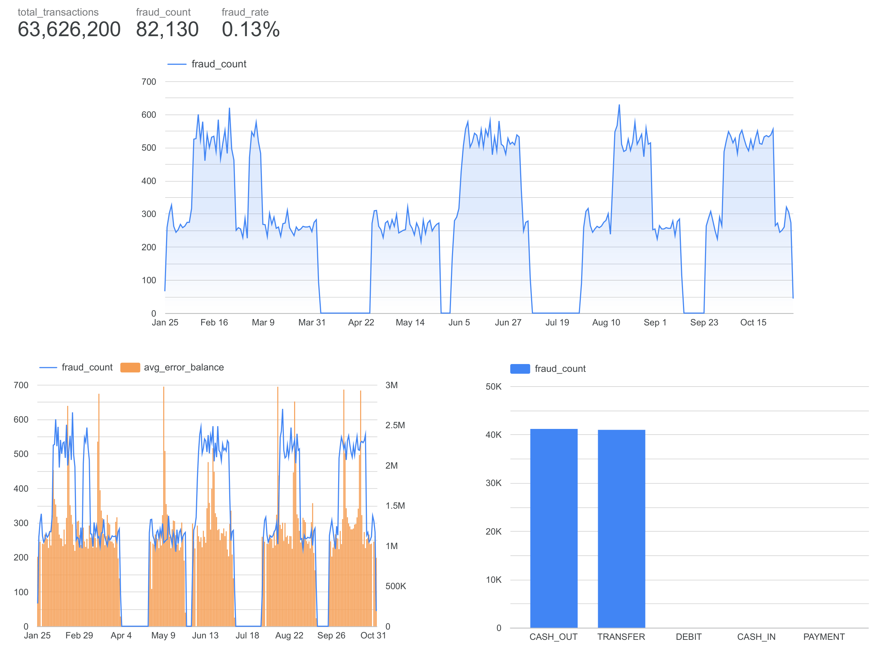

[Kaggle Dataset](https://www.kaggle.com/datasets/ealaxi/paysim1)


GCP Setup:
Login
```bash
gcloud init
```


```bash
gcloud config set conpute/region us-east1
```


Give IAM
```bash
gcloud projects add-iam-policy-binding project_id \
    --member="serviceAccount:your-account-name@project-id.iam.gserviceaccount.com" \
    --role="roles/owner"
```

Generate key
```bash
gcloud iam service-accounts keys create gcp-key.json \
        --iam-account=your-account-name@project-id.iam.gserviceaccount.com
```

Make bucket
```bash
gcloud storage buckets create gs:/your-bucket-name --location=us-east1
```

Data ingestion
```bash
gcloud storage cp -r data/transactions_augmented_parquet gs://your-bucket-name/processed/transactions/
```


1. Use PySpark to generate data

```bash
uv run python spark_jobs/data_generator.py
```

2. Use PySpark to ETL job

```bash
uv run python spark_jobs/etl_job.py
```


2. Send it to GCS


Big query make dataset
```bash
bq mk --location=us-east1 fraud_detection # dataset name
``` 

Make table
```bash
bq load \           
--source_format=PARQUET \
--replace \
fraud_detection.raw_transactions \
"gs://your-bucket-name/processed/transactions/*.parquet"
```

3. BigQuery + dbt

```bash
uv add dbt-bigquery 
```

~/.dbt/profiles.yml
```yaml
fraud_detection:
  outputs:
    dev:
      dataset: fraud_detection
      job_execution_timeout_seconds: 300
      job_retries: 1
      keyfile: /path/to/your/service-account-key.json
      location: us-east1
      method: service-account
      priority: interactive
      project: project_id
      threads: 4
      type: bigquery
  target: dev
```

```bash
dbt build
```


4. Dashboard by Google Looker Studio

